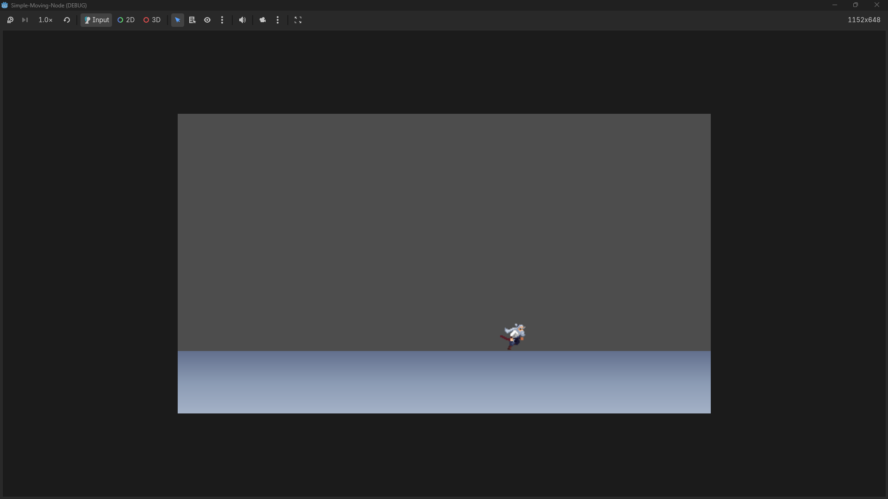
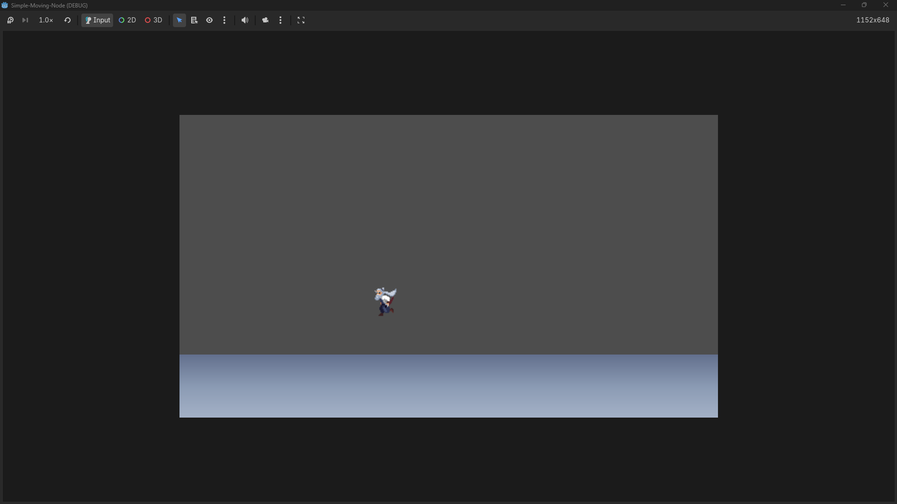
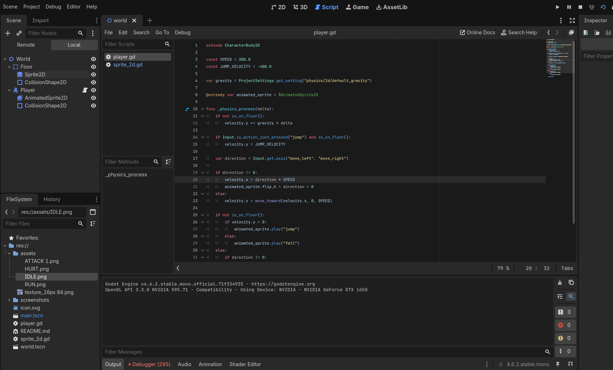
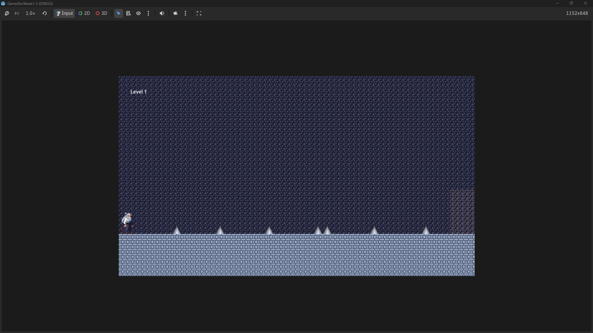
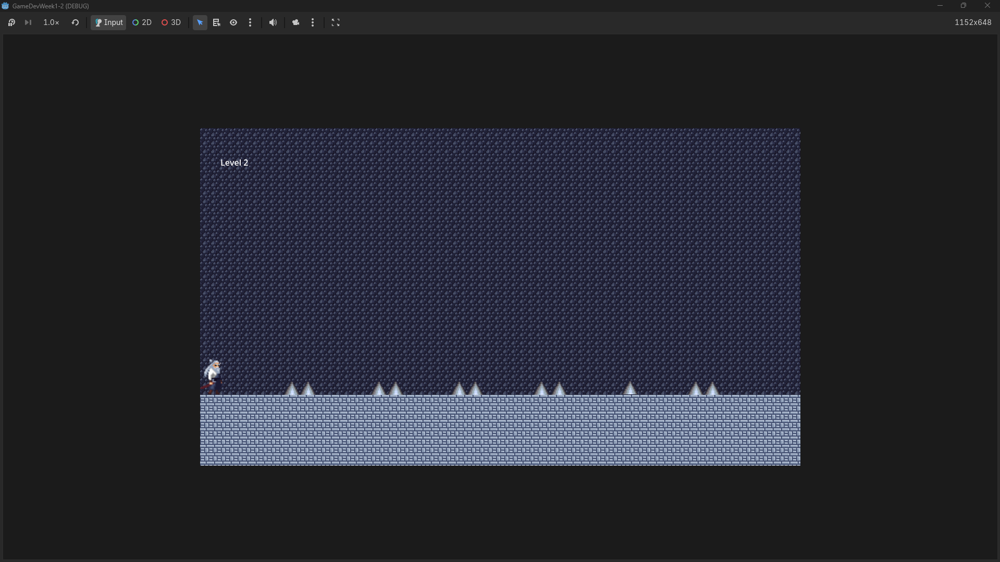
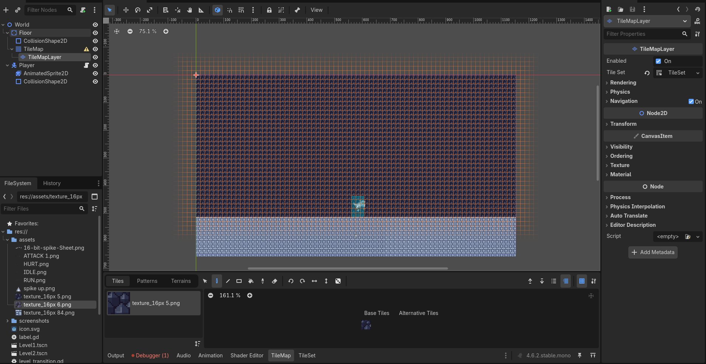
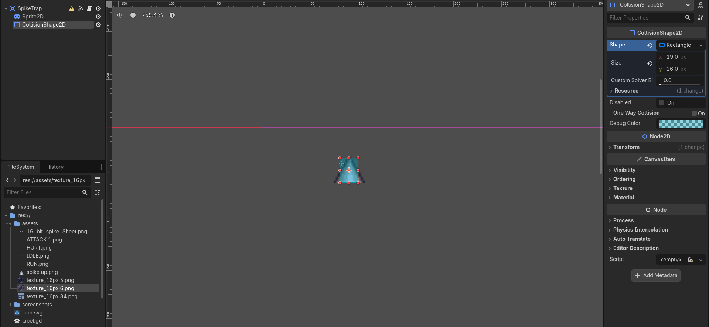

# Week 1 - Simple Scene with a Moving Node

## Activity Overview
This project demonstrates a basic 2D scene in Godot Engine featuring a "Hello World" label and a Sprite2D node that moves across the screen using a GDScript.

## Screenshots
 
*Figure 1: Editor setup with Label and Sprite2D nodes.*

 
*Figure 2: The scene running with the moving icon.*

 
*Figure 3: The script for the scenes.*

# Week 2 - Activity 1 Gameplay Mechanics!

## Activity Overview
Gameplay Mechanics
Subtopics: Handling input (keyboard/gamepad), physics bodies (rigid/kinematic), collision detection. Basics of player controllers (movement, jumping).

 
*Figure 4: The scene for player moving.*

 
*Figure 5: The scene for player jumping.*

 
*Figure 6: The second script for the scenes.*

# Week 2: Activity 2 - Level Design & Mechanics

## Gameplay Overview
This project features two distinct levels of a side-scrolling runner, demonstrating level flow, difficulty scaling, and hazard implementation.

### Mechanics Implemented
* **Tilemaps/Grid Levels:** Levels are structured to guide the player forward.
* **Difficulty Curve:** * **Level 1** serves as a tutorial/safe zone with minimal hazards and wide jump margins. 
  * **Level 2** introduces tighter platforming, multiple consecutive traps, and requires precise timing.
* **Hazards (No HP System):** Traps are implemented using `Area2D`. If the player's `CharacterBody2D` enters the trap's collision area, the `get_tree().reload_current_scene()` method is triggered, causing an instant reset.
* **Level Transitions:** Reaching the end of Level 1 triggers a scene change to Level 2, accompanied by an on-screen UI notification alerting the player of the new stage.

## Screenshots
 
*Figure 7: The Level 1.*
*(Add a screenshot of Level 1 and Level 2 here!)*

 
(screenshots/Level2fade.png) 
*Figure 8: The Level 2.*

 
 
*Figure 9 & 10: Tilemaps and Traps.*